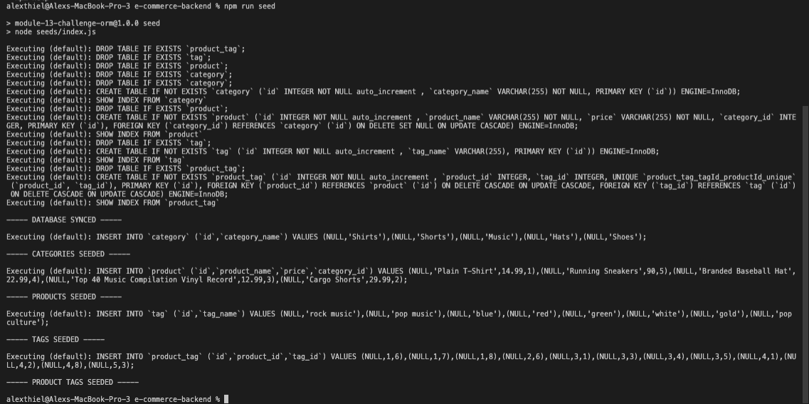
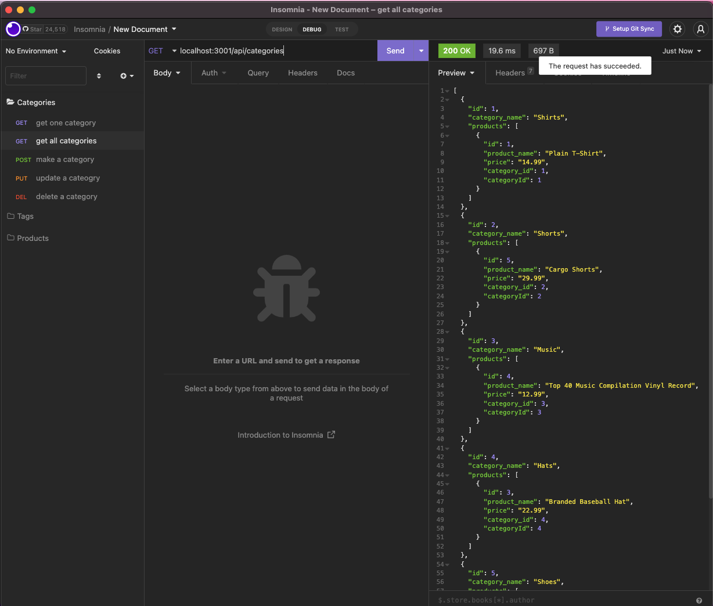
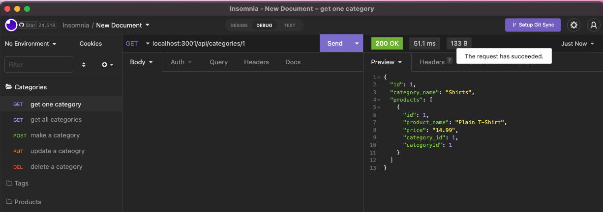
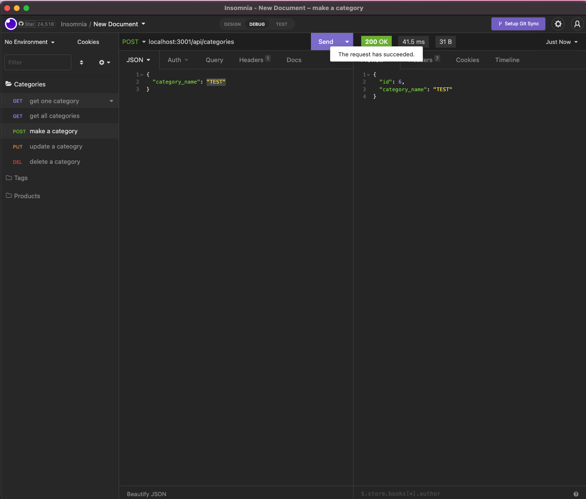
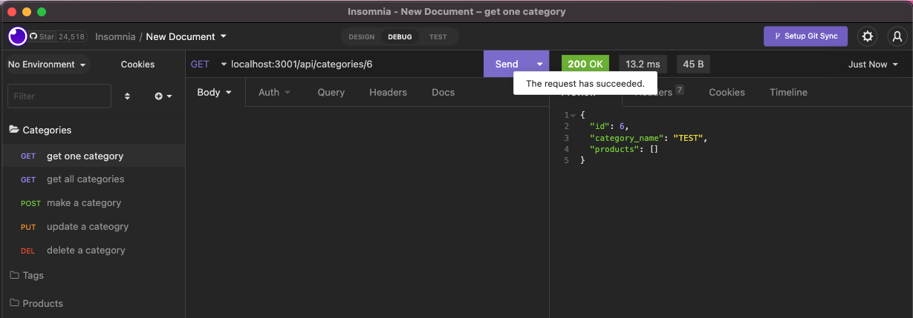
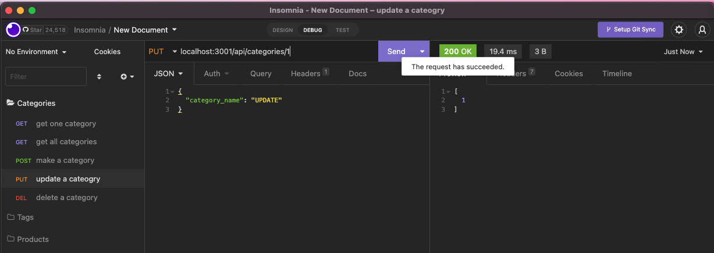
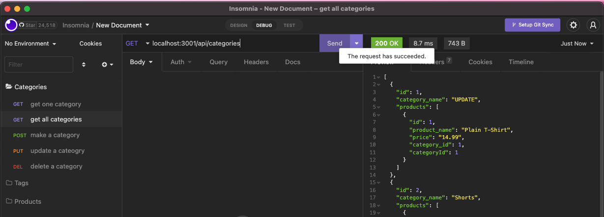
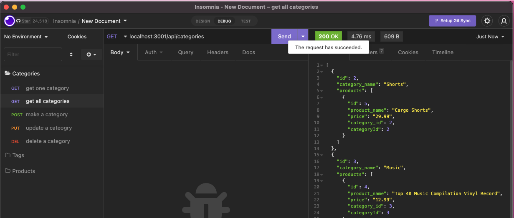

# E-Commerce Backend

## Description

The reason behind this application is to build a back end database to keep asign products to specific categories and tags, allowing for specification of products and storage of data.

## Installation

When downloaded from github, the package.json will already be prepared. All that needs to be done is run the integrated terminal in the Develop Folder and enter

```
npm i
```

This will download the library necessary to run the program.

if starting with only the index file, in the integrated terminal run the code

```
npm init
```

and follow it with

```
npm install inquirer
npm install fs
```

## Usage

- To start, open the integrated terminal and start mysql by inputting your password. Run the schema.sql to create the database then quit out of mysql.
- The next step is to rename the '.envExample' file to just '.env' and then open the file and input the database name 'ecommerce_db' and your database user and password.
- Now that the database is made and we can connect to the server, we should seed our data so that our tables in the database have inputs filled in them. Open the integrated terminal and run `npm run seed`



- Now that we have our data seeded, it's time to run the server. In the integrated terminal run `npm run start`. The program should state "Now listening" meaning that the PORT is now active.


- Now the different routes can be tested in Insomnia. For our three data tables we have we have full CRUD (Create, Read, Update, Delete). Sense every route is the same, we will sample one table data.
- with the GET `localhost:3001/api/categories` we can see every category made



- with the GET `localhost:3001/api/categories/1` we can see the category with the specific id of 1



- with the POST `localhost:3001/api/categories/` we can see a category is made with the name 'UPDATE' and an id of 6. This can now be seen in the GET specific category id




- with the PUT `localhost:3001/api/categories/1` we can update the category with the specific id of 1. In this case we changed the name to 'UPDATE'




- with the DELETE `localhost:3001/api/categories/1` we can delete the category with the specific id of 1. Now when all the categories are loaded, we start with the id of 2.




- All of these routes are very similar between each one. As to how these API routes specifically function behind the scenes can be seen in the routes folder.
- Refer to the [video](https://drive.google.com/file/d/1XDyyw-4Jhcy7HBomuoFSEDnIXYGTpFTK/view) to see the program step by step and how each function works.

# Test

Feel free to run the program as many times as you want trying different inputs in Insomnia.

# Issues and Future Implimentations

- one problem was making a product that had the appropritate tagIds. Further trouble shooting will need to be done in order to solve this minor error.
